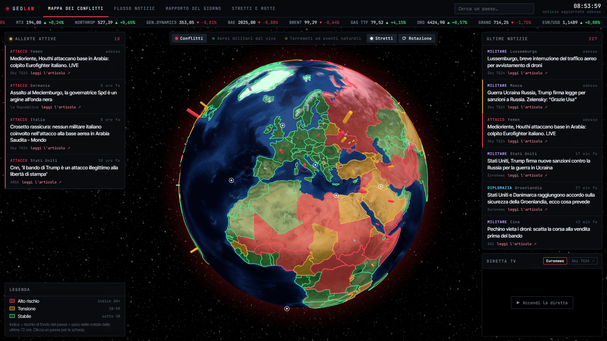

# GeoLaw — a geopolitical dashboard that runs on your own PC

A local, Italian-language "situation room": a 3D globe with every country coloured by an instability index, live foreign news from Italian outlets, country briefs, maritime chokepoints, live military aircraft, natural events and the markets that react to all of it.



No account, no API key, no subscription, nothing to install besides Python. One file of standard-library Python serves a plain HTML/JS page on `localhost`.

## What it shows

- **Conflict map** — globe with countries in red / amber / green by instability index, active alerts on the left, latest news on the right
- **News flow** — headlines from ANSA, Rai News, Sky TG24, la Repubblica, AGI, Il Post, Euronews, Analisi Difesa, Internazionale, tagged by country, place and type (attack, military, diplomacy, …)
- **Daily report** — what moved in the last 24 hours, index history kept for 30 days
- **Straits and routes** — Hormuz, Suez, Bab el-Mandeb, Malacca… with an embedded live ship map
- **Layers** — live military aircraft (adsb.lol), earthquakes and natural events (USGS, NASA EONET)
- **Ticker** — defence stocks, oil, gas, gold, wheat, EUR/USD

## Run it

```
python server.py --apri
```

It picks the first free port (4747, 5757, 6767, …) and opens the browser. On Windows you can double-click `Avvia Radar.bat`; `Spegni Radar.bat` stops it. Requires Python 3.9+ and an internet connection. The server only listens on `127.0.0.1`.

## How the index works

`index = baseline risk + news push` (max 100).

- **Baseline risk** is a hand-written estimate per country in [`dati/conoscenza.json`](dati/conoscenza.json). Edit it with any text editor.
- **News push** (up to +22) depends on how many headlines from the last 72 hours mention the country and what they are about: an attack weighs more than a summit, fresh news more than old.
- Red from 60, amber 38–59, green below.

Headlines are classified by keywords, so it is sometimes wrong. It is a tool to get oriented, **not an official assessment**, and the baseline numbers are one person's opinion.

## Make it yours

Everything that is knowledge rather than code lives in `dati/conoscenza.json`: countries and their aliases, places, straits, news sources, market symbols. Adding a feed or a chokepoint does not require touching Python. The keyword categories are at the top of `server.py`.

## Data and credits

News: RSS feeds of the outlets listed above (headlines link to the original articles; no article text is stored). Markets: Yahoo Finance chart endpoint (unofficial). Aircraft: [adsb.lol](https://adsb.lol). Natural events: USGS, NASA EONET. Ship map: MarineTraffic embed. Globe: [globe.gl](https://globe.gl), borders from [world-atlas](https://github.com/topojson/world-atlas), flags from flagcdn.com. Country list derived from [mledoze/countries](https://github.com/mledoze/countries) (ODbL).

One feed has an expired TLS certificate; for that feed only, the server falls back to an unverified connection (public RSS, read-only).

## Italiano

Cruscotto geopolitico in italiano che gira sul tuo PC: globo 3D con i paesi colorati per rischio, notizie estere in tempo reale dalle testate italiane, schede paese, stretti marittimi con le navi in diretta, aerei militari, mercati sensibili. Gratis, senza account e senza chiavi. Le istruzioni complete sono in [LEGGIMI.md](LEGGIMI.md).

## Author

Made by **Lorenzo Paoletta**. Private project, all rights reserved: see [LICENSE](LICENSE).
