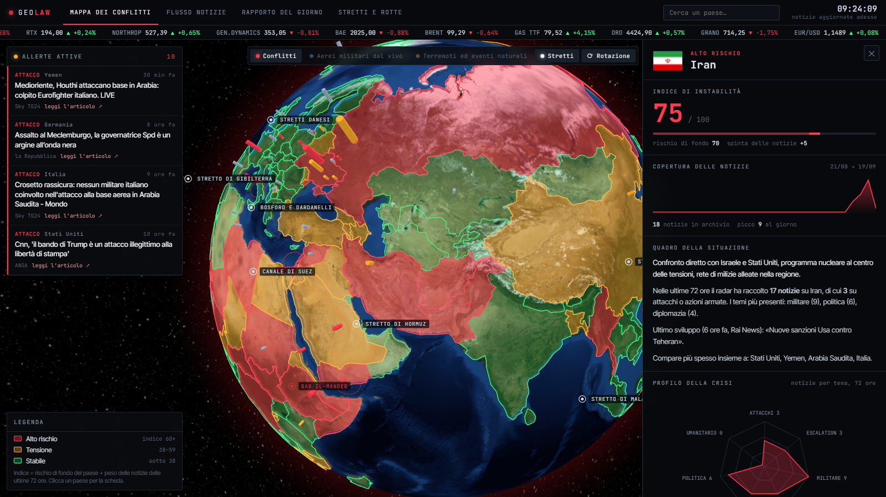
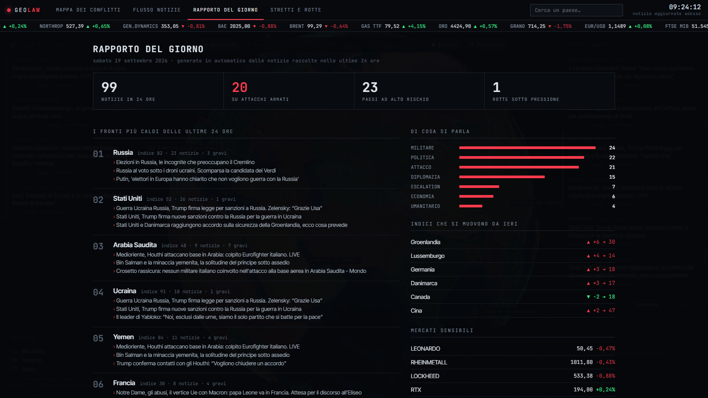

# GeoLaw

Un cruscotto geopolitico in italiano che gira sul tuo PC: un globo con i paesi colorati per livello di rischio, le notizie estere delle testate italiane man mano che escono, e qualche strumento per capire dove sta salendo la tensione.


## Perché l'ho fatto

Ho visto girare su TikTok un cruscotto di questo tipo: in inglese, con fonti americane, in abbonamento. Ne volevo uno mio, in italiano, che leggesse ANSA e Rai News invece della CNN e che non mi chiedesse né un account né una carta. Questo è il risultato.

Non è uno strumento professionale e non vuole sembrarlo: è un modo ordinato di guardare le notizie.

## Cosa fa

Nella **mappa** ogni paese ha un colore (rosso, arancione, verde) che dipende da un indice di instabilità. A sinistra ci sono le allerte, a destra le ultime notizie, sopra scorrono i titoli di borsa che reagiscono alle crisi: difesa, petrolio, gas, oro, grano.

Cliccando un paese, o cercandolo, si apre la sua scheda: indice, andamento delle notizie nell'ultimo mese, un quadro della situazione, i temi di cui si parla e i paesi che compaiono più spesso insieme a lui.



Il **rapporto del giorno** mette in fila i fronti più caldi delle ultime 24 ore, gli indici che si sono mossi da ieri e i mercati.



Poi ci sono il **flusso notizie** completo, gli **stretti e le rotte** (Hormuz, Suez, Bab el-Mandeb, Malacca e gli altri, con la mappa delle navi in diretta) e tre strati da accendere sul globo: aerei militari dal vivo, terremoti ed eventi naturali, stretti.

## Come si avvia

Serve solo Python 3. Io uso la 3.11 su Windows 11; su Mac e Linux dovrebbe andare, ma non l'ho provato. Non c'è niente da installare con pip: il motore usa solo la libreria standard.

```
python server.py --apri
```

Su Windows basta il doppio clic su `Avvia Radar.bat`. Per spegnerlo c'è `Spegni Radar.bat`: chiudere la scheda del browser non lo ferma, resta acceso a raccogliere notizie.

Il server ascolta solo su `127.0.0.1`. Prova la porta 4747 e, se è occupata, passa a 5757, 6767 e così via. Non è pignoleria: su Windows capita che blocchi interi di porte risultino riservati dal sistema senza un motivo visibile, e una porta fissa ogni tanto non partiva.

## Come nasce l'indice

`indice = rischio di fondo + spinta delle notizie`, con tetto a 100.

Il rischio di fondo è un numero che ho scritto io paese per paese in `dati/conoscenza.json`. È una stima, ed è discutibile: se non sei d'accordo lo cambi con il Blocco note.

La spinta delle notizie arriva fino a +22 e dipende da quante notizie delle ultime 72 ore parlano di quel paese e di che tipo sono. Un attacco pesa 3, un'escalation 2, una notizia militare 1,4, la diplomazia 0,5. Una notizia di un'ora fa conta più di una di due giorni fa.

Rosso da 60 in su, arancione da 38 a 59, verde sotto.

## Cambiarlo senza toccare il codice

Tutto quello che è conoscenza e non programma sta in `dati/conoscenza.json`: paesi, luoghi, stretti, testate, titoli di borsa.

Aggiungere una testata è una riga:

```json
{"nome": "ANSA", "url": "https://www.ansa.it/sito/notizie/mondo/mondo_rss.xml"}
```

I paesi e i luoghi si riconoscono nei titoli con espressioni regolari. Un `=` davanti rende la ricerca sensibile alle maiuscole, che serve per le parole ambigue:

```json
{"nome": "Gaza", "re": "gaza|=Striscia|rafah|khan yun[ie]s", "lat": 31.45, "lon": 34.4, "iso": "PSE"}
```

I falsi allarmi si tolgono in `server.py`: `RE_RUMORE` è l'elenco delle parole che fanno scartare un titolo (calcio, meteo, famiglia reale, oroscopo...) e `CATEGORIE` decide cosa è un attacco e cosa è diplomazia.

## Limiti che conosco

- Le notizie sono classificate per parole chiave, quindi ogni tanto sbaglia. "Attacco" nel titolo di una partita viene quasi sempre filtrato, quasi.
- I dati di borsa arrivano da un indirizzo di Yahoo Finance che non è un servizio ufficiale: può smettere di funzionare da un giorno all'altro.
- Gli aerei militari sono quelli con il transponder acceso. Quelli interessanti spesso lo tengono spento.
- La mappa delle navi e la diretta TV sono incorporate da MarineTraffic e YouTube: se cambiano le loro regole, spariscono. Sky TG24 non si lascia incorporare, per quello la diretta è Euronews.
- Il feed di Analisi Difesa ha il certificato scaduto. Solo per quel feed il motore accetta la connessione non verificata (è un RSS pubblico, in sola lettura).
- L'archivio tiene 30 giorni.
- È pensato per girare in locale. Non metterlo su un server esposto a internet così com'è.

## Strade provate e scartate

Le segno perché mi hanno fatto perdere tempo e magari lo risparmio a qualcuno.

- **GDELT**: l'API GEO risponde 404, la DOC accetta una richiesta ogni cinque secondi e spesso torna vuota.
- **restcountries**: dismesso. L'elenco dei paesi viene da [mledoze/countries](https://github.com/mledoze/countries).
- **Stooq** per i mercati: 404.

## Cose che vorrei aggiungere

Un riassunto del giorno scritto meglio di un elenco, uno storico più lungo di 30 giorni, e qualcosa sulle previsioni (Polymarket è l'unica fonte decente ma è tutta in inglese).

Se lo provi e qualcosa non funziona, apri una issue: la guardo.

## Dati e crediti

Notizie dai feed RSS di ANSA, Rai News, Sky TG24, la Repubblica, AGI, Il Post, Euronews, Analisi Difesa, Internazionale: si salvano titolo, il sommario breve del feed e il link; l'articolo si legge sul sito della testata. Mercati: Yahoo Finance. Aerei: [adsb.lol](https://adsb.lol). Terremoti ed eventi naturali: USGS e NASA EONET. Navi: MarineTraffic. Globo: [globe.gl](https://globe.gl), confini da [world-atlas](https://github.com/topojson/world-atlas), bandiere da flagcdn.com. Elenco paesi da mledoze/countries (licenza ODbL).

## In English

GeoLaw is a geopolitical dashboard that runs locally and speaks Italian: a 3D globe coloured by an instability index, live foreign news from Italian outlets, country briefs, maritime chokepoints, live military aircraft and the markets that react to crises. Standard-library Python, no accounts, no API keys. Run `python server.py --apri`. The interface and the news sources are Italian only.

## Licenza

MIT. Fatto da Lorenzo Paoletta.
